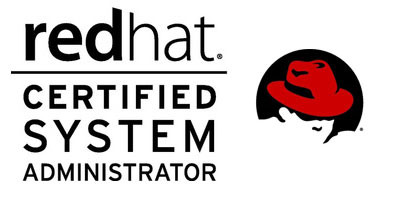

# Hi there 👋  Welcome to my bio 
## I'm Amandeep Singh - aka [adsingh007][twitter] 

- 🌱 I’m currently learning everything.👨🏻‍🎓
- 😎 I live in Delhi city
- 🥅 I'm looking to Contribute more on Open Source projects
- ⚡  Fun fact: I love to travel ,I love music & I'm foody.

### Connect with me:

[][Gmail]
[][twitter]
[][linkedin]
[][instagram]
 

[twitter]: https://twitter.com/007Amanvirdi
[youtube]: https://www.youtube.com/channel/UCIwrSDnkFEhWtI6QNNZRcig
[instagram]: https://www.instagram.com/sngh_ad
[linkedin]: https://www.linkedin.com/in/aman-virdi-87031654
[Gmail]: https://mail.google.com/mail/u/0/?tab=rm&ogbl#inbox

### Objectives:
To work for an organization which provides me the opportunity to improve my skills & knowledge to grow along with the organization.

### About Me:

I have 4+ years of Experience as a Sr. Assistant in IT & Ops Dept at DIMTS Ltd. Company basicly it is an transit organisation ,My key strength is i'am self motivated.
i have ability to learn fast and quick.I have basic knowledge about linux tools .Currently i'm learnig everythig to grow myself.You can find my passion [Here](mypassion.md)

### Academic Qualification: 

 
  
<b>EDUCATION TREE </b>

  <ol>  
     <li>
      :GRADUATION:
        </li>
  
    
| ***Degree/Qualification***  |  ***Graduated***  |
| :------: | :-----: | 
|B.Tech [Information Technology]  | 2017 |
      
          
 
  
       
| ***INTERMEDIATE Qualification***  | ***Session***  |
| :------: | :-----: |
|N.I.O.S [NON Medical]  | 2013|     
     
  
      
       
| ***MATRICULATION Qualification***  |  ***Session***  |
| :------: | :-----: | 
|C.B.S.E ]   | 2011 |     
</ol>

### Certifications:

- RHCSA
  Red Hat Certified System Administrator
  Red Hat Enterprise 7.0	
   
   </a> 
   
   

### credits
- https://github.com/codeSTACKr/codeSTACKr
- https://github.com/anuraghazra/github-readme-stats

